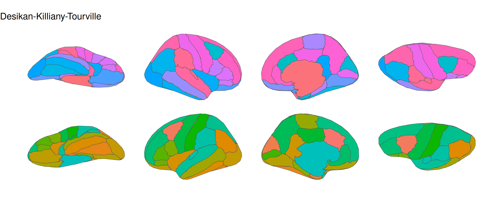
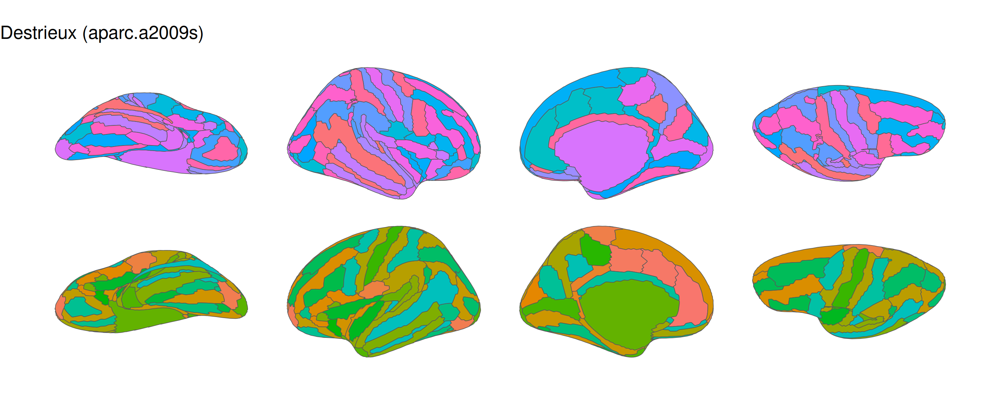
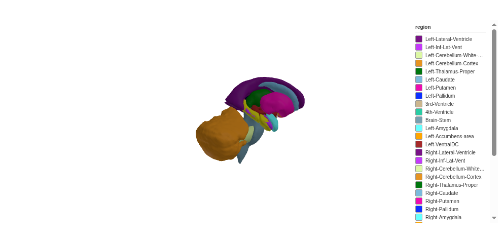

<!-- README.md is generated from README.qmd. Please edit that file -->

# ggsegFreeSurfer

<!-- badges: start -->

[](https://github.com/ggsegverse/ggsegFreeSurfer/actions)
<!-- badges: end -->

This package provides FreeSurfer cortical and subcortical brain atlases
formatted for use with [ggseg](https://ggseg.github.io/ggseg/) and
[ggseg3d](https://ggseg.github.io/ggseg3d/).

| Atlas                      | Function      | Type        | Regions/hemi |
|----------------------------|---------------|-------------|--------------|
| Desikan-Killiany-Tourville | `dkt()`       | Cortical    | 32           |
| Destrieux                  | `destrieux()` | Cortical    | 75           |
| HCP Subcortical            | `hcpa()`      | Subcortical | –            |

To learn how to use these atlases, please look at the documentation for
[ggseg](https://ggseg.github.io/ggseg/) and
[ggseg3d](https://ggseg.github.io/ggseg3d/).

## Installation

You can install ggsegFreeSurfer from [GitHub](https://github.com/) with:

``` r
# install.packages("remotes")
remotes::install_github("ggsegverse/ggsegFreeSurfer")
```

## Atlases

``` r
library(ggseg)
library(ggsegFreeSurfer)
library(ggplot2)

ggplot() +
  geom_brain(
    atlas = dkt(),
    mapping = aes(fill = label),
    position = position_brain(hemi ~ view),
    show.legend = FALSE
  ) +
  ggtitle("Desikan-Killiany-Tourville") +
  theme_void()
```



``` r
ggplot() +
  geom_brain(
    atlas = destrieux(),
    mapping = aes(fill = label),
    position = position_brain(hemi ~ view),
    show.legend = FALSE
  ) +
  ggtitle("Destrieux (aparc.a2009s)") +
  theme_void()
```



``` r
library(ggseg3d)

ggseg3d(atlas = hcpa())
```


