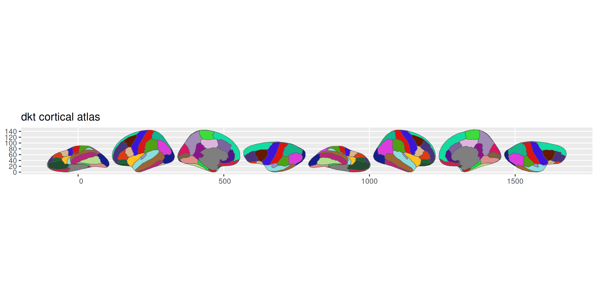
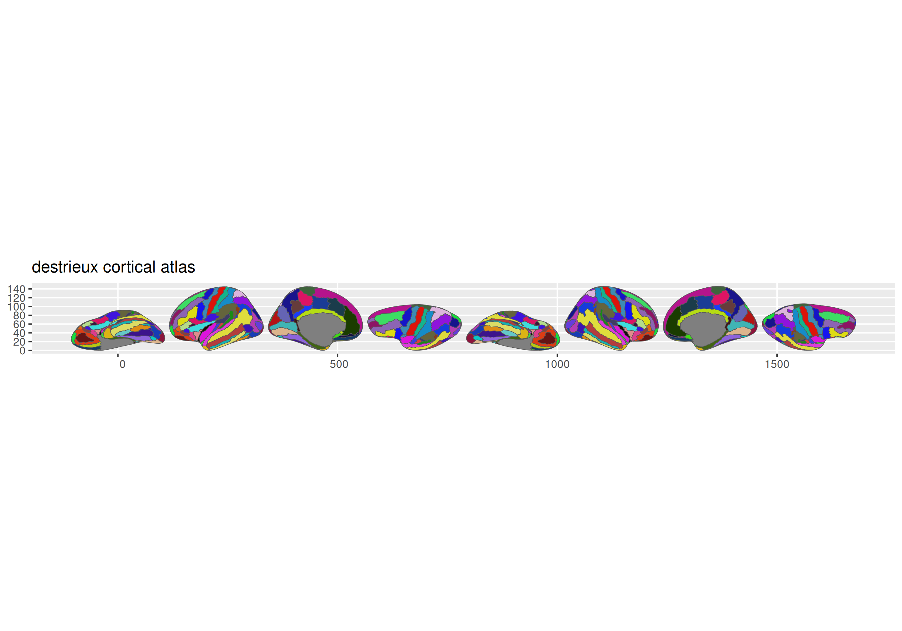

<!-- README.md is generated from README.qmd. Please edit that file -->

# ggsegFreeSurfer

<!-- badges: start -->

[](https://github.com/ggsegverse/ggsegFreeSurfer/actions/workflows/R-CMD-check.yaml)
[](https://ggseg.r-universe.dev/ggsegFreeSurfer)
<!-- badges: end -->

This package provides FreeSurfer cortical and subcortical brain atlases
formatted for use with ggseg.

## Installation

We recommend installing the ggseg-atlases through the ggseg
[r-universe](https://ggseg.r-universe.dev/ui#builds):

``` r
options(repos = c(
  ggseg = "https://ggseg.r-universe.dev",
  CRAN = "https://cloud.r-project.org"
))

install.packages("ggsegFreeSurfer")
```

You can install this package from [GitHub](https://github.com/) with:

``` r
# install.packages("pak")
pak::pak("ggsegverse/ggsegFreeSurfer")
```

## Desikan-Killiany-Tourville (DKT) atlas

``` r
library(ggseg)
library(ggsegFreeSurfer)

plot(dkt())
```



## Destrieux atlas

``` r
plot(destrieux())
```



## Data source

Desikan RS, Segonne F, Fischl B, Quinn BT, Dickerson BC, Blacker D, … &
Killiany RJ (2006). An automated labeling system for subdividing the
human cerebral cortex on MRI scans into gyral based regions of interest.
*NeuroImage*, 31(3), 968-980.

Destrieux C, Fischl B, Dale A, & Halgren E (2010). Automatic
parcellation of human cortical gyri and sulci using standard anatomical
nomenclature. *NeuroImage*, 53(1), 1-15.
