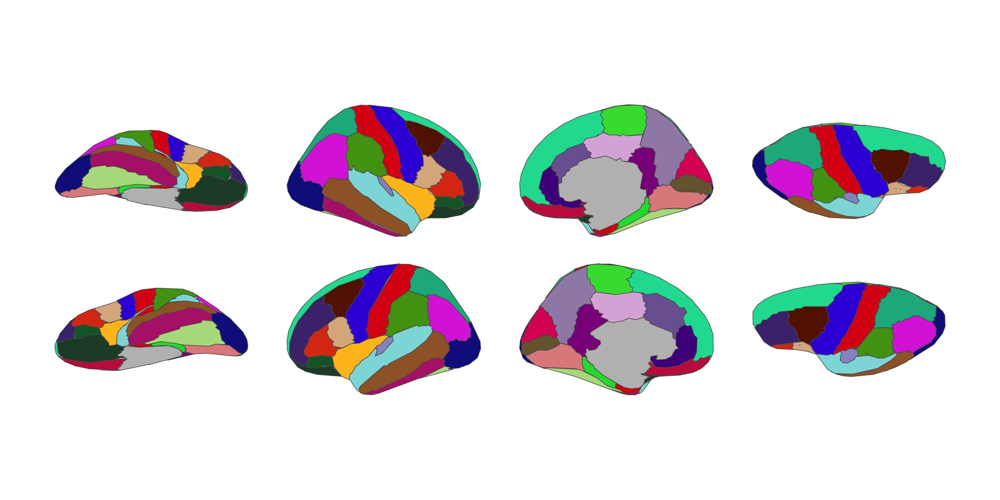

# ggsegFreeSurfer

This package provides FreeSurfer cortical and subcortical brain atlases
formatted for use with ggseg.

## Installation

We recommend installing the ggseg-atlases through the ggseg
[r-universe](https://ggseg.r-universe.dev/ui#builds):

``` r
options(repos = c(
  ggseg = "https://ggseg.r-universe.dev",
  CRAN = "https://cloud.r-project.org"
))

install.packages("ggsegFreeSurfer")
```

You can install this package from [GitHub](https://github.com/) with:

``` r
# install.packages("pak")
pak::pak("ggsegverse/ggsegFreeSurfer")
```

## Desikan-Killiany-Tourville (DKT) atlas

``` r
library(ggseg)
library(ggsegFreeSurfer)
library(ggplot2)

ggplot() +
  geom_brain(
    atlas = dkt(),
    mapping = aes(fill = label),
    position = position_brain(hemi ~ view),
    show.legend = FALSE
  ) +
  scale_fill_manual(values = dkt()$palette, na.value = "grey") +
  theme_void()
```



## Destrieux atlas

``` r
ggplot() +
  geom_brain(
    atlas = destrieux(),
    mapping = aes(fill = label),
    position = position_brain(hemi ~ view),
    show.legend = FALSE
  ) +
  scale_fill_manual(values = destrieux()$palette, na.value = "grey") +
  theme_void()
```


## Data source

Desikan RS, Segonne F, Fischl B, Quinn BT, Dickerson BC, Blacker D, … &
Killiany RJ (2006). An automated labeling system for subdividing the
human cerebral cortex on MRI scans into gyral based regions of interest.
*NeuroImage*, 31(3), 968-980.

Destrieux C, Fischl B, Dale A, & Halgren E (2010). Automatic
parcellation of human cortical gyri and sulci using standard anatomical
nomenclature. *NeuroImage*, 53(1), 1-15.
